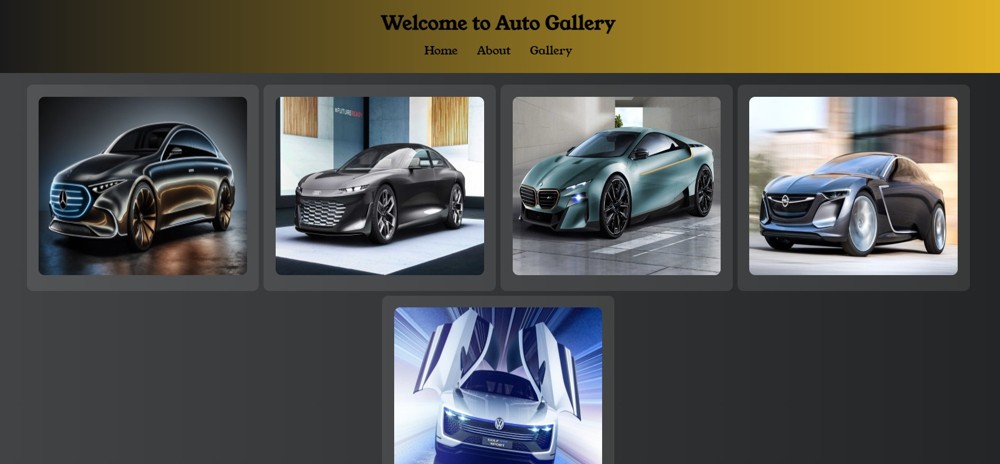

# Mehmet's Gallery

This project contains Mehmet's car gallery. It is developed using HTML and CSS.

## Technologies Used

- HTML
- CSS

## Live Demo

Click [here](https://flex-al-ma-2.vercel.app/) for the live demo.

## Screenshots

## Functionality

- Users can browse through the cars in the gallery.
- When hovering over each car, the brand of the car is displayed.

## Installation

Download or clone the project files to your computer:

Then, open the `index.html` file in your browser to run the application.

## Contribution

This project is open to any kind of contribution. If you have any suggestions or contributions, please open a pull request or create an issue to share your ideas.

## Follow on GitHub

To follow the project on GitHub:

[]

